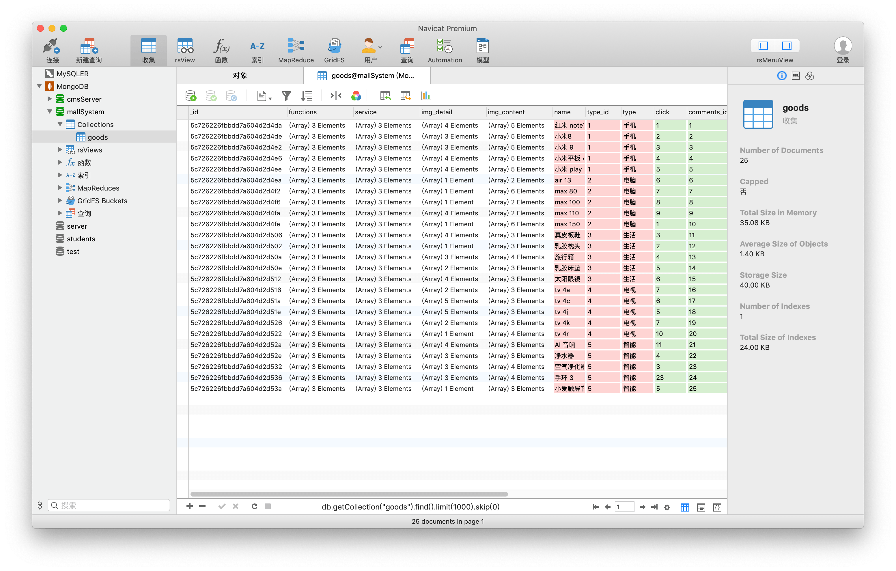

<div align="center">
	
	<br>
	<br>
	<p>
		<sup>If you wanna know more about me, plase to my homepage</sup>
		<br>
		<a href="https://stevecchow.github.io/homepage/">
			
		</a>
	</p>
	<br>
	<br>
</div>


## Project Name

`mallServer 商城服务器`


## MongoDB

### 1 example：goods

### 

## API

```shell
['/api/types','/api/getTypeAll/:id','/api/getRecom','/api/getWipe/:id','/api/good/:id','/api/allGoods']
```

### 1 解释

- status：
  - 为 0，代表后台数据获取 失败
  - 为 1，代表后台数据获取 成功
- message：
  - 数据详情


### 2 获取所有产品类型

- 格式：`/api/types`

- 例如：`http://localhost:3000/api/types`

- 返回值：

- ```javascript
  {
      "status":1,
      "message":[
          {"type_id":"1","type":"手机"},
          {"type_id":"2","type":"电脑"},
          {"type_id":"3","type":"生活"},
          {"type_id":"4","type":"电视"},
          {"type_id":"5","type":"智能"}
      ]
  }
  ```


### 3 获取某一类型下的所有产品

- 格式：`/api/getTypeAll/:type_id`

- 例如：

  - 获取所有 手机产品 数据
  - `http://localhost:3000/getTypeAll/1`

- 返回值：(部分信息多长，已省略)

- ```javascript
  {
      "status": 1,
      "message": [
      {
          "functions": ["超大屏", "双摄像头", "持久待机"],
          "service": ["自营", "7天无理由退货", "保修3年"],
          "img_detail": [...],
          "img_content": ...
          "_id": "5c726226fbbdd7a604d2d4da",
          "name": "红米 note7",
          "type_id": "1",
          "type": "手机",
          "click": 1,
          "comments_id": 1,
          "img_ads":...
          "versions": [
          {
              "color": ["红", "黑", "白"],
              "_id": "5c726226fbbdd7a604d2d4dd",
              "model": "3GB + 32GB",
              "old_price": 1399,
              "now_price": 1299,
              "inventory": 60
          },
          {
              "color": ["红", "白"],
              "_id": "5c726226fbbdd7a604d2d4dc",
              "model": "3GB + 64GB",
              "old_price": 1599,
              "now_price": 1499,
              "inventory": 60
          },
          {
              "color": ["红"],
              "_id": "5c726226fbbdd7a604d2d4db",
              "model": "3GB + 128GB",
              "old_price": 1999,
              "now_price": 1899,
              "inventory": 60
          }],
          "__v": 0,
          "slog": "show出你的精彩"
      },
      {
          "functions": ["超大屏", "双摄像头", "持久待机"],
          "service": ["自营", "7天无理由退货", "保修3年"],
          "img_detail": ...
          "name": "小米8",
          "type_id": "1",
          "type": "手机",
          "click": 2,
          "comments_id": 2,
          "img_ads": ...
          "versions": [
          {
              "color": ["红", "黑", "白"],
              "_id": "5c726226fbbdd7a604d2d4e1",
              "model": "3GB + 32GB",
              "old_price": 1399,
              "now_price": 1299,
              "inventory": 60
          },
          {
              "color": ["红", "白"],
              "_id": "5c726226fbbdd7a604d2d4e0",
              "model": "3GB + 64GB",
              "old_price": 1599,
              "now_price": 1499,
              "inventory": 60
          },
          {
              "color": ["红"],
              "_id": "5c726226fbbdd7a604d2d4df",
              "model": "3GB + 128GB",
              "old_price": 1999,
              "now_price": 1899,
              "inventory": 60
          }],
          "__v": 0,
          "slog": "用了小米8，一路发发发"
      },
      {
          "functions": ["超大屏", "双摄像头", "持久待机"],
          "service": ["自营", "7天无理由退货", "保修3年"],
          "img_detail": ...
          "name": "小米 9",
          "type_id": "1",
          "type": "手机",
          "click": 3,
          "comments_id": 3,
          "img_ads": ...
          "versions": [
          {
              "color": ["红", "黑", "白"],
              "_id": "5c726226fbbdd7a604d2d4e5",
              "model": "3GB + 32GB",
              "old_price": 1399,
              "now_price": 1299,
              "inventory": 60
          },
          {
              "color": ["红", "白"],
              "_id": "5c726226fbbdd7a604d2d4e4",
              "model": "3GB + 64GB",
              "old_price": 1599,
              "now_price": 1499,
              "inventory": 60
          },
          {
              "color": ["红"],
              "_id": "5c726226fbbdd7a604d2d4e3",
              "model": "3GB + 128GB",
              "old_price": 1999,
              "now_price": 1899,
              "inventory": 60
          }],
          "__v": 0,
          "slog": "9是完美"
      },
          ...
  }
  ```


### 4 获取推荐商品数据

- 格式：`/api/getRecom`

- 例如：`http://localhost:3000/api/getRecom`

- 返回值：

- ```javascript
  // 略
  ```


### 5 获取相应 swipe 数据

- 注意：

  - 需要自行在前端进行解析

  - ```javascript
    this.wipeList = []
    var arr = result.body.message
    console.log(arr)
    for (var i in arr) {
        this.wipeList.push(arr[i].img_ads)
    }
    ```

- 格式：`/api/getWipe/:type_id`

- 例如：

  - 获取手机的 wipeList
  - `http://localhost:3000/api/getWipe/1`

- 返回值：

- ```javascript
  // 略
  ```


### 6 获取某一 id 商品

- 格式：`/api/good/:id`

- 例如：

  - 获取 红米 note 7 的商品数据
  - `http://localhost:3000/api/good/5c726226fbbdd7a604d2d4da`

- 返回值：

- ```javascript
  {
      "status": 1,
      "message": [
      {
          "functions": ["超大屏", "双摄像头", "持久待机"],
          "service": ["自营", "7天无理由退货", "保修3年"],
          "img_detail": [...],
          "img_content": [...],
          "_id": "5c726226fbbdd7a604d2d4da",
          "name": "红米 note7",
          "type_id": "1",
          "type": "手机",
          "click": 1,
          "comments_id": 1,
          "img_ads": "...",
          "img_banner": "...",
          "versions": [
          {
              "color": ["红", "黑", "白"],
              "_id": "5c726226fbbdd7a604d2d4dd",
              "model": "3GB + 32GB",
              "old_price": 1399,
              "now_price": 1299,
              "inventory": 60
          },
          {
              "color": ["红", "白"],
              "_id": "5c726226fbbdd7a604d2d4dc",
              "model": "3GB + 64GB",
              "old_price": 1599,
              "now_price": 1499,
              "inventory": 60
          },
          {
              "color": ["红"],
              "_id": "5c726226fbbdd7a604d2d4db",
              "model": "3GB + 128GB",
              "old_price": 1999,
              "now_price": 1899,
              "inventory": 60
          }],
          "__v": 0,
          "slog": "show出你的精彩"
      }]
  }
  ```


### 7 获取所有商品信息

- 格式：`/api/allGoods`

- 例如：`http://localhost:3000/api/getWipe/1`

- 返回值：

- ```javascript
  // 略
  ```


## License

MIT


